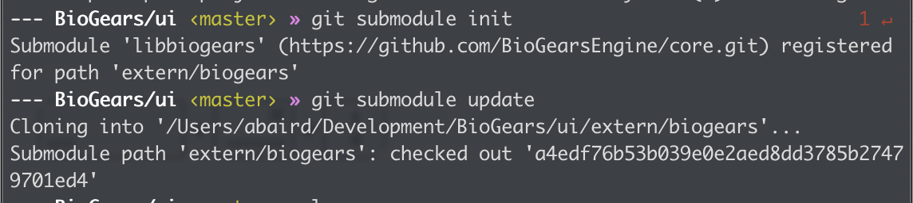
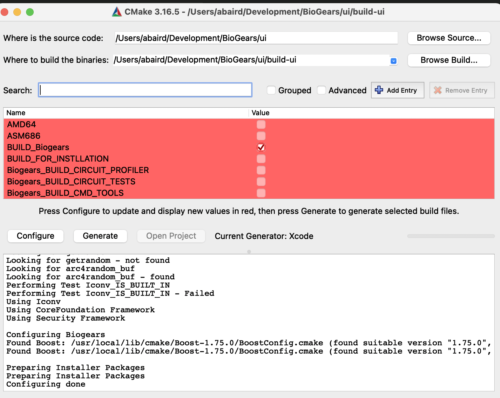
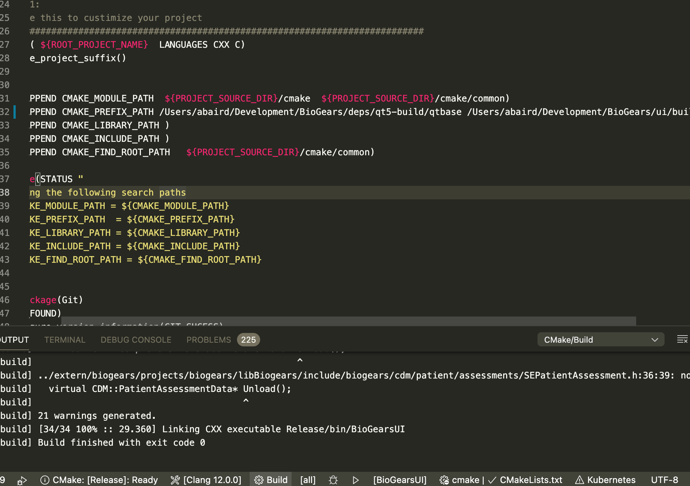
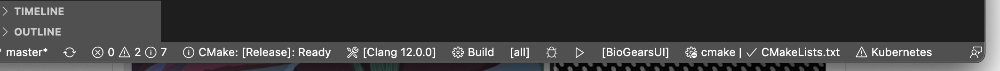
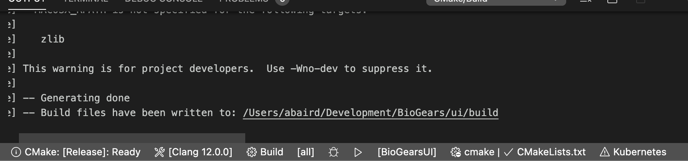
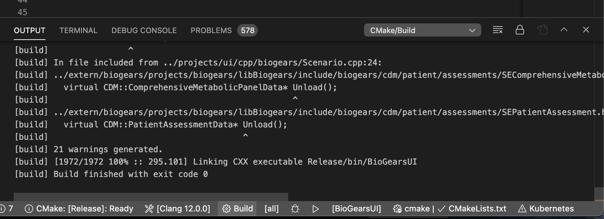
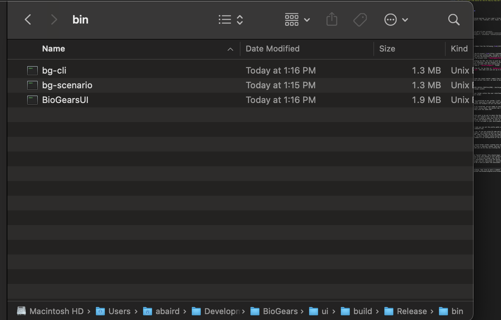
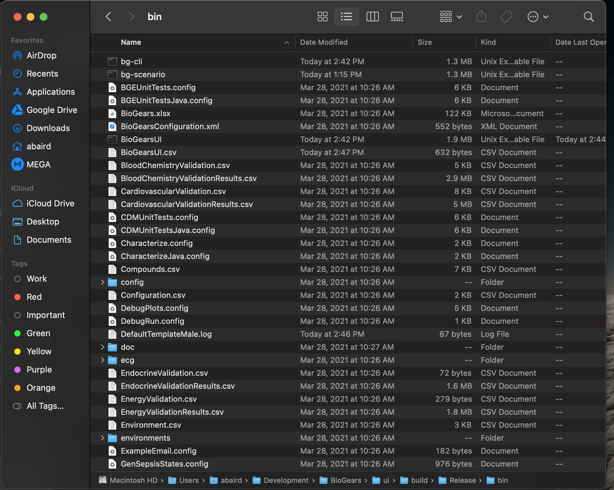
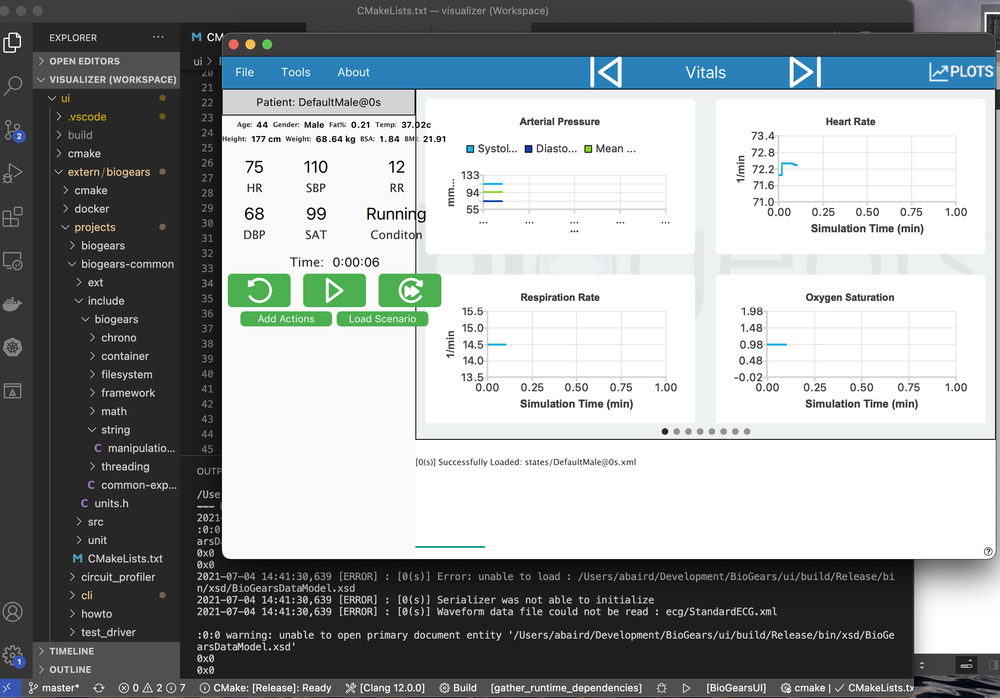

BioGears UI on a Mac
==================

These instructions will mostly be taken from the following [link](https://github.com/ajbaird/ui).

Cloning and Building
-------------------
Firs thing we want to do is fork the UI project [link](https://github.com/ajbaird/ui). Once you have it forked on your github page, navigate tot the repository and clone the repository into the directory structure of your choice. For this tutorial I'll be cloning the project into `~/Development/BioGears/`. 

Once cloned we will go through building the GUI. For this to work we first need to have a built copy of BioGears to reference. The git project is structured in such a way that there is a submodule included that once initialized, will clone a copy of the BioGears code base into a `./extern/biogears/` folder.

From the root of where you cloned the UI, for me this is `BioGears/ui`, then in the terminal type `git submodule init` then make sure you are up to date with `git submodule update` . 

This command will automatically clone the latest master commit from the BioGears core project. Once BioGears has been pulled from core, we need to build BioGears 

'''
mkdir build-biogears
cd build-biogears
cmake ../projectslibbiogears -DCMAKE_INSTALL_PREFIX=${PWD}../build-gui/usr 
cmake --build . -config Release -target install 
'''

This command will install to the usr folder within the user interface, all build files will be in the build-biogears folder. 

We also need to make sure that Qt is installed on our system. I will not cover cloning and building Qt but it is VERY important to make sure that you download and install Qt version 5.12, otherwise the BioGears UI will not work. 

Now that we have BioGears AND Qt 5.12 installed, we are ready to install the UI, first we want to configure the project using cmake. The easiest way to do this is to navigate to the build directory with the cmake GUI: 

Now we need to configure cmake prefix path to be set to where the BioGears core libs are located. We can do this via the command line, or you can set them in the cmakeLists.txt file. For my use, I'm going to open this file in VS code, then append the prefix path to include the BioGears libs, as well as where the Qt install is (this is only if Qt is not included in your environment paths): 

**Note:** If you are not using VS code you can set the prefix paths either through the cmake UI, OR via the command line.

Now everything should be ready to run. If you are using VS code and have installed the cmake third party support, you should be able to run the configure command at the bottom of the screen, make sure that you set the compiler for your system (here I'm using clang, via mac). BioGears should build for most modern c++ compilers. Here is an example of my configuration at the bottom of the VS code UI: 

Note to make sure that you have a build folder either created with cmake, or create it yourself via the command line or explorer window. Now you can configure the project. Using VS code you can do this by clicking the cmake button and selecting "Release"

Now going left to right, click the "build" button, this should begin the build for the set configuration. When you click this button it will build all available targets, if you only want to build one target (say the UI) and not the scenario executor (a core biogears executable) then click the button just to the right of "build" and select the target you are interested in. Everything should compile correctly and there should be a note on where the executable is located: 

Now double check that all of the executables are built and in the appropriate folder, they should be located in the /bin folder under releases, you can see if you select the project to build "all" there will be the command line utilities and scenario executor in that folder as well as the UI: 

Now lets test and run the application. In order to do this, there is one last thing that we need to do. First, navigate to where the BioGears core runtime directory is, for me its `./ui/build-biogears/runtime` basically it will be anywhere you built the biogears dependencies. Copy the contents of that folder and drop it into the `./ui/build/Release/bin` folder. Now that folder should have a lot of content: 

Once completed you should be able to now click the play arrow in VS studio and have the UI launch! 

If you have other issues while building, feel free to post a comment on the community pages ([link](https://github.com/BioGearsEngine/ui/issues))!
