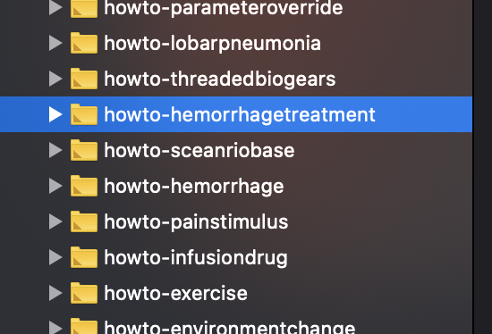
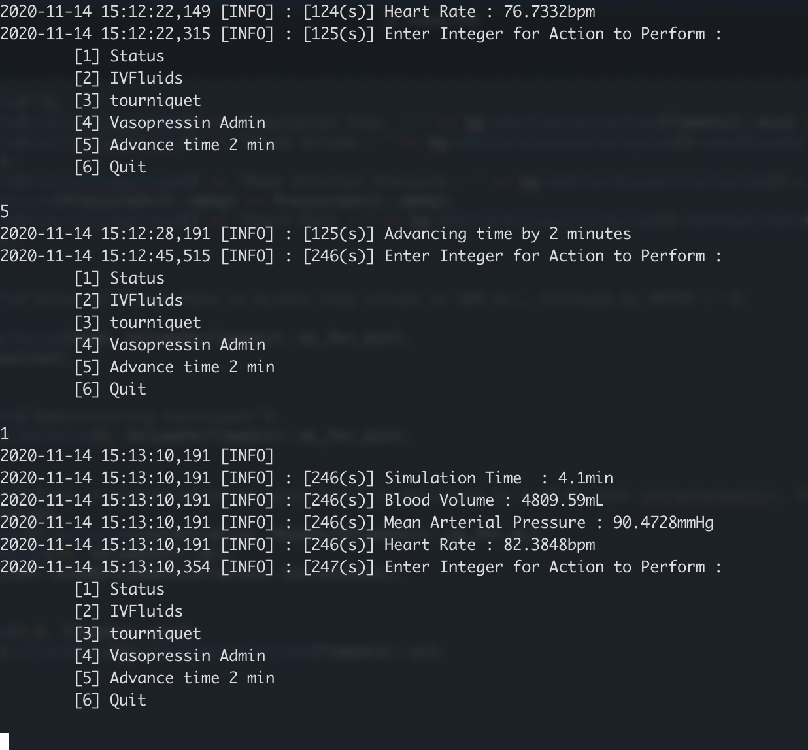

Leveraging BioGears libraries to write your own HowTo
==================

We have BioGears built and ready to go but the question is, now what? What can we do with BioGears, how powerful is it and what type of applications can be build with it? These are some of the questions we will address in this tutorial on developing your own application leveraging BioGears API tools in C++. In this tutorial you will learn to: 

- Create a fork of your BioGears project
- Create a new howto project and verify CMAKE configs 
- Modify the hemorrhage existing howto to include vasopressin and fluid administration 
- Use the command line to log vitals and administer treatments to the patient
- Get an overview of data requests and their structure

Running a HowTo file
-------------------
To start lets first just verify that we can, in fact, run one of the many HowTo files provided by BioGears when we clone the repository. If you followed, the first post on this site you should have built BioGears as well as all the HowTos. If you didn't complete that please refer back this that [post](https://austinbaird.dev/post/buildingbiogears/). To run a HowTo file simply execute the binaries in the proper directory. In this example I'm going to be running the HowToHemorrhage file. This will give the patient a hemorrhage located in the spleen, at a rate of 150 ml/min. The below image shows you what the command will be.


 because I'm using xcode as my development environment, I'll be executing the code from the runtime directory generated by xcode, located in the buildxcode folder. Once the how to is running you should see the following being logged in your command window.


If there are no errors on the console output, then chances are everything ran correctly but just to double check. Since we ran the howto from the runtime directory, the data should be located in that same directory. Verify that a HowToHemorrhage.csv and HowToHemorrhage.log both were generated in runtime (there are a LOT of files in runtime so sorry in advance for making you track it down). The .csv file holds all of the data request data printed each time step (or whenever the user specifies) and the .log file holds all the information that was printed to the terminal. 

Creating a new HowTo project
-------------------
Now if BioGears is cloned from github, we will now need to set our remote to a fork of the repository so that all the code we push is our own. Once we are happy with what we've created then you can always push back changes to be integrated into the master branch of core. To do this, reference this [link](https://gist.github.com/jagregory/710671). Once completed if you type `git remote -v` you should see your origin set to your fork branch and upstream is still set to the BioGears core repository. Now we you can rebase origin off the upstream repository in the future and submit pull requests back to upstream! 

First step to creating a new project is to just copy the hemorrhage folder under `core/projects/howto/hemorrhage` This will pull all the existing files that we just ran and will be the basis for the work that we want to do. To update the projects list in Xcode we need to re-configure and generate the project using CMAKE. The image below shows our new howto project titled hemorrhagetreatment. Generally, these projects are laid out as a main file that runs routines, you can see this structure of the project if you look at the files included from the hemorrhage howto.



Creating a patient vitals logger
------------------------------------
Ultimately, we want to create a command line tool that lets us: 
- display patient vitals 
- give treatment to the patient
- alert us to any patient events that may occur 

To do this we will start with baby steps, first lets just make a program that lets us configure the patient bleed rate and location and displays patient vitals every 10 seconds. To begin, lets lean on the dynamic sepsis and hemorrhage how tos. We start with creating the BioGears engine an loading in the patient state file: 

```c++
void HowToHemorrhageTreatment()
{
   // Create the engine and load the patient
  std::unique_ptr<PhysiologyEngine> bg = 
          CreateBioGearsEngine("HowToHemorrhageTreatment.log");
  bg->GetLogger()->Info("HowToHemorrhageTreatment");
  bool simulation = true;
    
// Load patient
  if (!bg->LoadState("./states/StandardMale@0s.xml")) {
    bg->GetLogger()->Error("Could not load state, check the error");
    return;
  }
  ```
Then we need to set all the data requests that we want to be logged to our .csv file we will create: 

```c++
  bg->GetEngineTrack()->GetDataRequestManager().CreatePhysiologyDataRequest().
  Set("HeartRate", FrequencyUnit::Per_min);
  bg->GetEngineTrack()->GetDataRequestManager().CreatePhysiologyDataRequest().
  Set("BloodVolume", VolumeUnit::mL);
  bg->GetEngineTrack()->GetDataRequestManager().CreatePhysiologyDataRequest().
  Set("CardiacOutput", VolumePerTimeUnit::mL_Per_min);
  bg->GetEngineTrack()->GetDataRequestManager().CreatePhysiologyDataRequest().
  Set("MeanArterialPressure", PressureUnit::mmHg);

  bg->GetEngineTrack()->GetDataRequestManager().
  SetResultsFilename("HowToHemorrhageTreatment.csv");
  ```
For this application we will just be concerned with cardiovascular system outputs such as cardiac output and mean arterial pressure. See other how tos and scenarios for more examples of the types of data requests we may configure.

No we will set up a simple cin to store the location and rate of the hemorrhage, in the example below we are restricting the user to a select number of locations and fixed units for the bleed rate. Fancier applications may want to expand these options. BioGears has a generic unit conversion engine built in and the supports numerous hemorrhage locations.

```c++
  std::string hemorrageLocation;
  int hemorrageRate;

  std::cout << "Please type the location of the hemorrhage as: leftleg, spleen, 
  or aorta. Followed by the rate of the bleed (assuming units of mL/min), 
  ex. leftleg 150 " << std::endl;
  std::cin >> hemorrageLocation >> hemorrageRate;
  //Process update to hemorrhage action
  hem.SetCompartment(hemorrageLocation);
  bg->ProcessAction(hem);
  ```

Now we will initialize some parameters we will use in this simulation, here we will create objects for vasopressin and saline and a few other variables used in the do case: 

```c++
  int action;
  bool simulation = true;
  double rate;
  double concentration;
  SESubstance* vas = bg->GetSubstanceManager().GetSubstance("Vasopressin");
  SESubstanceBolus bolus(*vas);
  SESubstanceCompound* saline = bg->GetSubstanceManager().GetCompound("Saline");
  SESubstanceCompoundInfusion* salineInfusion = 
          new SESubstanceCompoundInfusion(*saline);
  salineInfusion->GetBagVolume().SetValue(500, VolumeUnit::mL);
  ```


Now lets log some information to the command line for the user to interact with. We want to let them administer saline, administer a tourniquet, vasopressin, advance time for a few minutes, or log patient information, we will construct this tool as a do loop to continue logging:

```c++
  do {
    bg->GetLogger()->Info("Enter Integer for Action to Perform : 
    \n\t[1] Status \n\t[2] IVFluids \n\t[3] tourniquet 
    \n\t[4] Vasopressin Admin \n\t[5] Quit \n");
    std::cin >> action;
  ```

Now this next block of code will enact actions that are initialized by the user, each case will correspond to a different action we want to allow the user to push to BioGears during runtime: 

```c++
do {
    bg->AdvanceModelTime(1.0, TimeUnit::s);
    bg->GetEngineTrack()->TrackData(bg->GetSimulationTime(TimeUnit::s));
    bg->GetLogger()->Info("Enter Integer for Action to Perform : \n\t[1] Status 
    \n\t[2] IVFluids \n\t[3] tourniquet \n\t[4] Vasopressin Admin 
    \n\t[5] Advance time 2 min \n\t[6] Quit \n");
    std::cin >> action;
    switch (action) {
    case 1:
      bg->GetLogger()->Info("");
      bg->GetLogger()->Info(std::stringstream() << "Simulation Time  : " 
      << bg->GetSimulationTime(TimeUnit::min) << "min");
      bg->GetLogger()->Info(std::stringstream() << "Blood Volume : " 
      << bg->GetCardiovascularSystem()->GetBloodVolume(VolumeUnit::mL) 
      << "mL";
      bg->GetLogger()->Info(std::stringstream() << "Mean Arterial Pressure : " 
      << bg->GetCardiovascularSystem()->
      GetMeanArterialPressure(PressureUnit::mmHg) << "mmHg";
      bg->GetLogger()->Info(std::stringstream() << "Heart Rate : " 
      << bg->GetCardiovascularSystem()->GetHeartRate(FrequencyUnit::Per_min) 
      << "bpm");
      break;
    case 2:
      bg->GetLogger()->Info("Enter IV Fluids Rate in mL/min 
      (bag volume is 500 mL), followed by ENTER : ");
      std::cin >> rate;
      saline->GetRate().SetValue(rate, VolumePerTimeUnit::mL_Per_min);
      bg->ProcessAction(*saline);
      break;
    case 3:
      bg->GetLogger()->Info("Administering tourniquet");
      hem.GetInitialRate().SetValue(0, VolumePerTimeUnit::mL_Per_min);
      break;
    case 4:
      bg->GetLogger()->Info("Enter a concentration in ug/mL 
      (will be delivered by a 10 mL push intravesnously), followed by ENTER : ");
      std::cin >> concentration;
      bolus.GetConcentration().SetValue(concentration, 
      MassPerVolumeUnit::ug_Per_mL);
      bolus.GetDose().SetValue(10, VolumeUnit::mL);
      bolus.SetAdminRoute(CDM::enumBolusAdministration::Intravenous);
      break;
    case 5:
      bg->AdvanceModelTime(2.0, TimeUnit::min);
      bg->GetEngineTrack()->TrackData(bg->GetSimulationTime(TimeUnit::s));
      break;
    case 6:
      simulation = false;
      break;
      }
    } while(simulation);
  
  bg->GetLogger()->Info("Finished");

  ```

If it is running correctly your console screen should look the like this 




To confirm that the simulation ran and logged the appropriate data, navigate to the runtime directory and make sure that the HowtoHemorrhageTreatment.log and HowtoHemorrhageTreatment.csv file are present. You can then use your favorite data analysis tool to plot the results you are interested in. 

To see the full set of code developed for this tutorial, please see the [github page](https://github.com/ajbaird/core/tree/masterFork/projects/howto/HemorrhageTreatment/src)


If you have other issues feel free to post a comment on the community pages ([link](https://github.com/BioGearsEngine/core/issues))!
