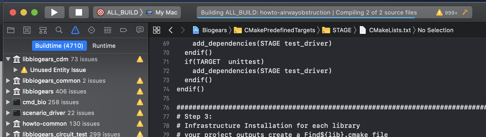
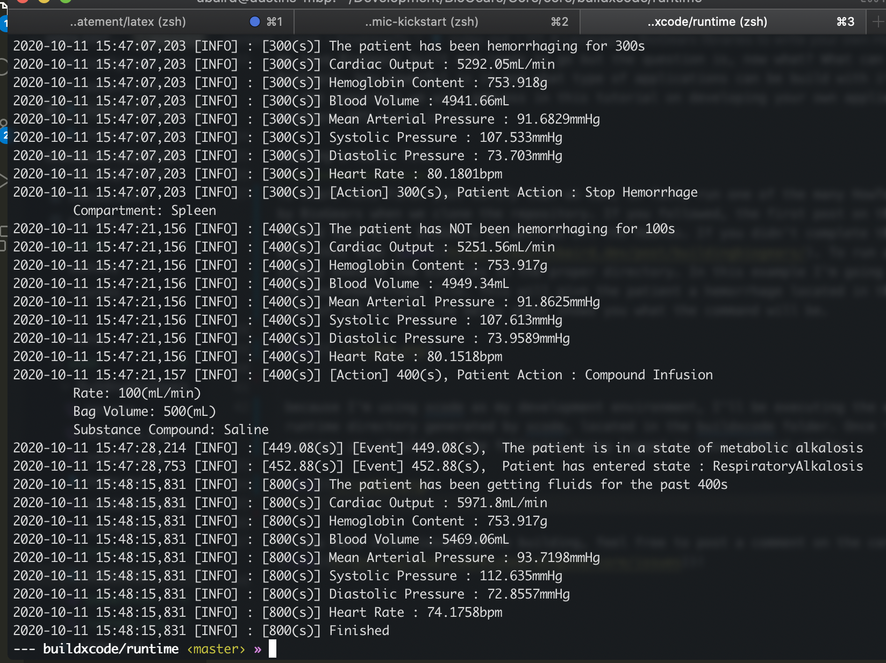

Leveraging BioGears libraries to write your own HowTo
==================

We have BioGears built and ready to go but the question is, now what? What can we do with BioGears, how powerful is it and what type of applications can be build with it? These are some of the questions we will address in this tutorial on developing your own application leveraging BioGears API tools in C++. 

Running a HowTo file
-------------------
To start lets first just verify that we can, in fact, run one of the many HowTo files provided by BioGears when we clone the repository. If you followed, the first post on this site you should have built BioGears as well as all the HowTos. If you didn't complete that please refer back this that [post](https://austinbaird.dev/post/buildingbiogears/). To run a HowTo file simply execute the binaries in the proper directory. In this example I'm going to be running the HowToHemorrhage file. This will give the patient a hemorrhage located in the spleen, at a rate of 150 ml/min. The below image shows you what the command will be.

 because I'm using xcode as my development environment, I'll be executing the code from the runtime directory generated by xcode, located in the buildxcode folder. Once the how to is running you should see the following being logged in your command window.

If you have other issues while building, feel free to post a comment on the community pages ([link](https://github.com/BioGearsEngine/core/issues))!
